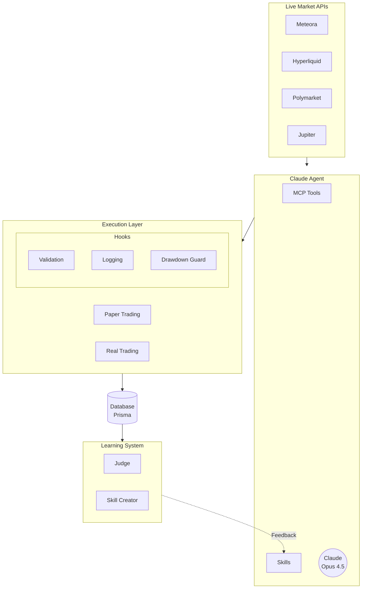
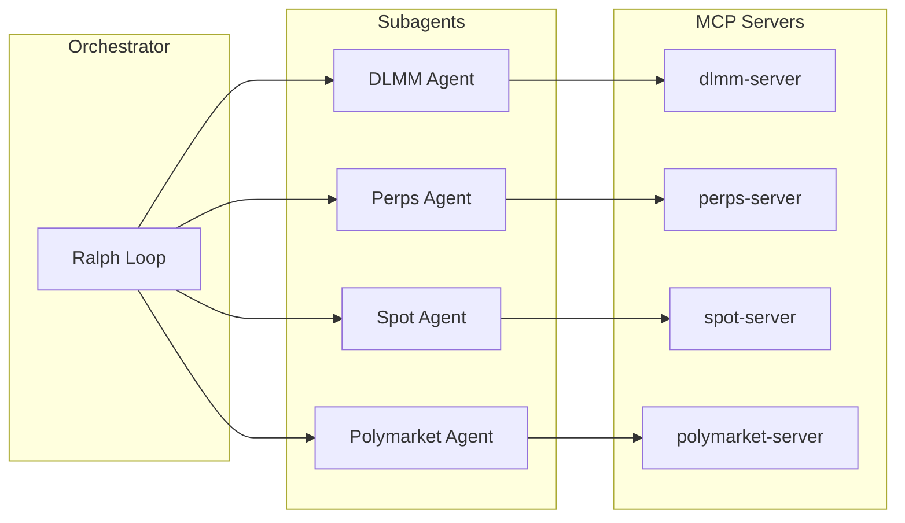
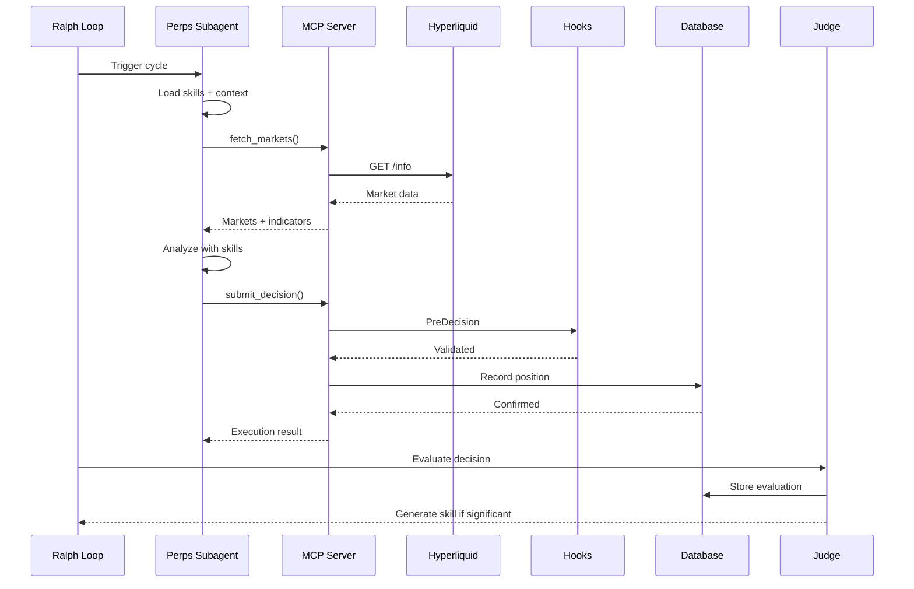

# Architecture Overview

claudefi is built as a modular, event-driven system with clear separation between market data, decision-making, and execution layers.

## High-Level Data Flow

## Component Interaction

## Core Components

### 1. Orchestrator (Ralph Loop)

The central coordinator that runs the continuous trading cycle:

- Schedules domain execution
- Coordinates cross-domain intelligence
- Manages skill lifecycle
- Handles error recovery

See [The Ralph Loop](./ralph-loop.md) for details.

### 2. Subagents

Domain-specific Claude agents, each with:

- Custom system prompt with trading strategies
- MCP tools for market data and execution
- Session persistence for multi-turn conversations
- Access to relevant skills

### 3. MCP Servers

Model Context Protocol servers that expose tools to Claude:

- `dlmm-server.ts` - Meteora pool operations
- `perps-server.ts` - Hyperliquid trading
- `polymarket-server.ts` - Prediction markets
- `spot-server.ts` - Token swaps

See [MCP Server Overview](../mcp-server/overview.md) for details.

### 4. Clients

Direct API clients for each platform:

- **Meteora Client** - DLMM pool data and LP operations
- **Hyperliquid Client** - Perp trading and positions
- **Jupiter Client** - Token swaps and pricing
- **Gamma Client** - Polymarket data

See [Clients](../clients/meteora.md) for API details.

### 5. Skills System

Self-improvement through outcome analysis:

- Warning skills from losses
- Pattern skills from wins
- Strategy skills from experience
- Automatic expiration and archiving

See [Skills System](../skills/overview.md) for details.

### 6. Hooks System

Event-driven middleware for validation and logging:

- Pre/post decision hooks
- Tool use interception
- Global risk controls

See [Hooks System](../hooks/overview.md) for details.

### 7. Database Layer

Prisma ORM with SQLite (local) or PostgreSQL (production):

- Position tracking
- Decision history
- Skill effectiveness
- Performance snapshots

See [Database Schema](../database/schema.md) for details.

## Decision Flow Example

Here's what happens when claudefi decides to open a perps position:

## Design Principles

### Separation of Concerns

- **Market Data**: Clients handle API specifics
- **Decision Logic**: Claude with prompts and skills
- **Execution**: Hooks validate, executor acts
- **Learning**: Judge and skill creator analyze

### Fail-Safe Design

- Paper trading by default
- Multiple validation hooks
- Position limits per domain
- Global drawdown protection

### Extensibility

- New domains: Add client + MCP server + prompts
- New hooks: Register via hook registry
- New skills: Generated automatically from outcomes

## Related Documentation

- [The Ralph Loop](./ralph-loop.md) - Execution cycle details
- [Directory Structure](./directory-structure.md) - Code organization
- [MCP Server Overview](../mcp-server/overview.md) - Tool system
