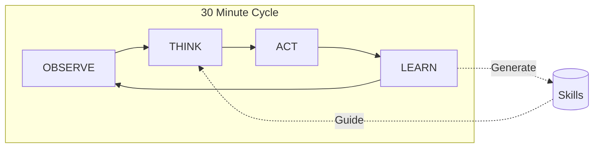
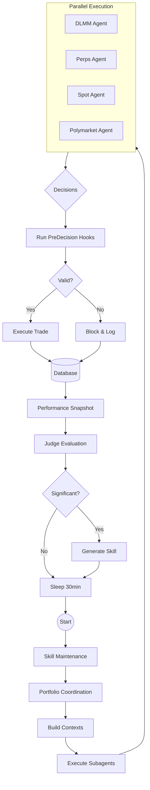
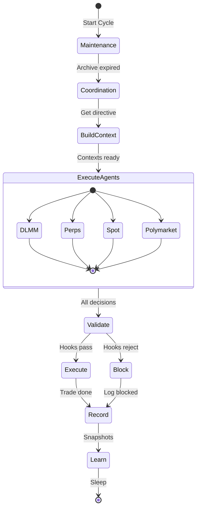

# The Ralph Loop

The Ralph Loop is claudefi's core execution cycle - a continuous loop that runs every 30 minutes (configurable) to observe markets, make decisions, execute trades, and learn from outcomes.

## Cycle Overview



## Detailed Cycle Flow



## Cycle Steps

### Step 0: Skill Maintenance

Before each cycle, expired skills are archived:

```typescript
await archiveExpiredSkills();
```

Skills have TTLs (60-180 days depending on type) and are moved to `.claude/skills/archive/` when expired.

### Step 0.5: Portfolio Coordination

Cross-domain intelligence gathering:

```typescript
const portfolioDirective = await getPortfolioDirective(marketSummary);
```

This analyzes:
- Current allocation across domains
- Correlation between positions
- Market regime (risk-on vs risk-off)
- Suggested rebalancing

### Step 1: Build Contexts

Fetch live data for all active domains:

```typescript
const contexts = await buildContextsForAllDomains();
```

Each domain context includes:
- Current market data (prices, volumes, indicators)
- Open positions
- Available balance
- Active skills for the domain
- Recent decision history

### Step 2: Execute Subagents

Run all domain agents in parallel:

```typescript
const decisions = await executeAllSubagentsParallel(
  anthropic,
  domains,
  contexts
);
```

Each subagent:
1. Receives its domain context
2. Uses MCP tools to gather additional data
3. Analyzes against skills and strategies
4. Submits a decision via `submit_decision` tool

### Step 3: Validate & Execute

Run hooks and execute approved decisions:

```typescript
for (const decision of decisions) {
  // Run pre-decision hooks
  const hookResult = await hookRegistry.run('PreDecision', { decision });

  if (hookResult.proceed) {
    await executeDecision(decision);
    await hookRegistry.run('PostDecision', { decision, result });
  } else {
    console.log(`Decision blocked: ${hookResult.reason}`);
  }
}
```

See [Hooks System](../hooks/overview.md) for available hooks.

### Step 4: Learn

Take snapshots and evaluate decisions:

```typescript
// Record performance
await takePerformanceSnapshots();

// Evaluate recent closed positions
const closedPositions = await getRecentlyClosedPositions();
for (const position of closedPositions) {
  // Judge evaluates decision quality
  await evaluateDecision(position);

  // Generate skill if outcome was significant
  if (isSignificantOutcome(position)) {
    await generateSkill(position);
  }
}
```

### Step 5: Repeat

Wait for the next cycle:

```typescript
await sleep(CYCLE_INTERVAL_MS); // Default: 30 minutes
```

## State Machine View



## Configuring the Loop

### Cycle Interval

```bash
# Environment variable (milliseconds)
CYCLE_INTERVAL_MS=1800000  # 30 minutes (default)
CYCLE_INTERVAL_MS=900000   # 15 minutes
CYCLE_INTERVAL_MS=3600000  # 1 hour
```

### Active Domains

```bash
# Run all domains
ACTIVE_DOMAINS=dlmm,perps,polymarket,spot

# Run subset
ACTIVE_DOMAINS=dlmm,perps
```

### Single Domain Mode

Run only one domain:

```bash
npm run claudefi:dlmm      # Only DLMM
npm run claudefi:perps     # Only Perps
```

## Error Handling

The loop is designed to be resilient:

```typescript
try {
  // ... cycle logic
} catch (error) {
  // Log error but continue
  await hookRegistry.run('OnError', { error });
  console.error('[Ralph] Cycle error:', error);

  // Optional: Telegram notification
  await sendAlert(`Ralph Loop Error: ${error.message}`);
}

// Always continue to next cycle
await sleep(CYCLE_INTERVAL_MS);
```

Individual domain failures don't stop other domains:

```typescript
const results = await Promise.allSettled(
  domains.map(domain => executeSubagent(domain))
);

// Process successful results
const decisions = results
  .filter(r => r.status === 'fulfilled')
  .map(r => r.value);
```

## Monitoring

### Console Output

```
[Ralph] Starting cycle 47...
[Ralph] Loading skills... 18 active skills
[Ralph] Portfolio directive: Reduce perps exposure, market showing weakness
[Ralph] Building contexts for 4 domains...
[DLMM] Analyzing 15 pools...
[Perps] 3 open positions, checking exits...
[Polymarket] 2 markets near resolution...
[Spot] Scanning trending tokens...
[Ralph] Decisions: DLMM=HOLD, Perps=PARTIAL_CLOSE, Poly=BUY_YES, Spot=HOLD
[Ralph] Cycle 47 complete. Next in 30m.
```

### Database Monitoring

View cycle history in Prisma Studio:

```bash
npm run db:studio
```

Check:
- `Decision` table for decision history
- `Position` table for open/closed positions
- `PerformanceSnapshot` for P&L over time

## Related Documentation

- [Architecture Overview](./overview.md) - System design
- [Skills System](../skills/overview.md) - Learning from outcomes
- [Hooks System](../hooks/overview.md) - Validation middleware
