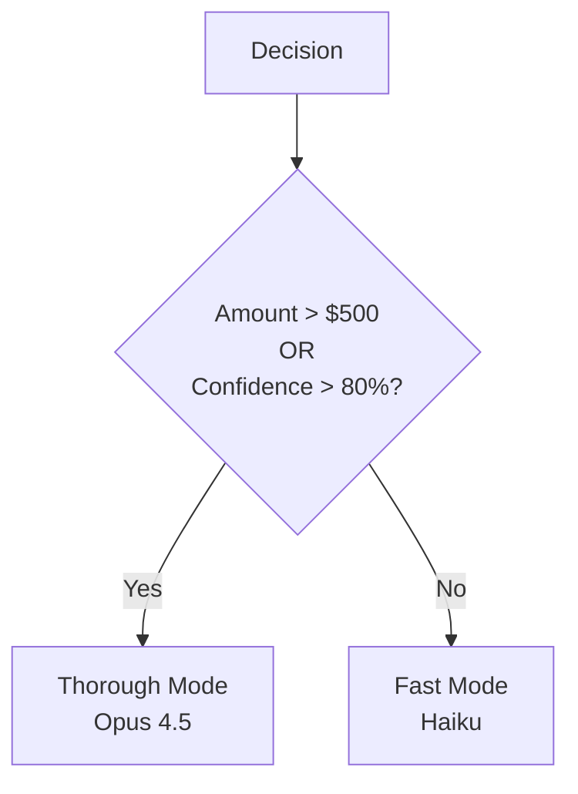
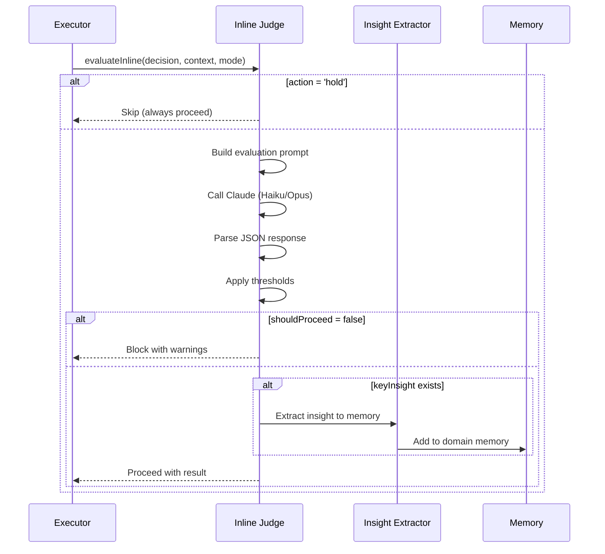

# Inline Judge

The inline judge provides **same-cycle evaluation** of trading decisions. Unlike the async judge that evaluates after execution, the inline judge can **block bad decisions before they happen**.

## Why Inline Evaluation?

The previous async judge had a critical limitation:

```
Decision Made → Trade Executed → Judge Evaluates (30+ min later)
                      ↑
              Too late to prevent bad trades!
```

The inline judge fixes this:

```
Decision Made → Inline Judge → Block/Proceed → Trade Executed
                      ↓
              Can prevent bad trades!
```

## Evaluation Modes

### Fast Mode (Default)

- **Model**: Claude 3.5 Haiku
- **Target latency**: 1-2 seconds
- **Max tokens**: 500
- **Use for**: Most decisions

### Thorough Mode

- **Model**: Claude Opus 4.5
- **Target latency**: 5-10 seconds
- **Max tokens**: 1000
- **Use for**: High-stakes decisions

## Mode Selection

The mode is automatically selected based on decision characteristics:



```typescript
function selectJudgeMode(decision: AgentDecision): JudgeMode {
  const amountUsd = decision.amountUsd || 0;
  const confidence = decision.confidence || 0;

  if (amountUsd > 500 || confidence > 0.8) {
    return 'thorough';
  }
  return 'fast';
}
```

## Evaluation Result

```typescript
interface InlineJudgeResult {
  shouldProceed: boolean;      // Execute the trade?
  qualityScore: number;        // 0.0-1.0 decision quality
  warnings: string[];          // Issues to be aware of
  keyInsight: string | null;   // Most important observation
  suggestedModifications?: {
    adjustedConfidence?: number;
    adjustedAmount?: number;
    additionalReasoning?: string;
  };
  latencyMs: number;           // Evaluation time
}
```

## Blocking Thresholds

A decision is automatically blocked when:

| Condition | Threshold | Reason |
|-----------|-----------|--------|
| Quality too low | < 40% | Poor reasoning quality |
| Risk too high | > 80% | Excessive risk exposure |
| Adjusted confidence too low | < 50% | Judge thinks confidence is unjustified |

```typescript
const BLOCK_THRESHOLDS = {
  minQualityScore: 0.4,
  maxRiskLevel: 0.8,
  minConfidenceAfterReview: 0.5,
};
```

## Evaluation Flow



## Prompt Structure

The inline judge receives:

1. **Decision details**: Action, target, amount, confidence, reasoning
2. **Current context**: Balance, positions, recent decisions
3. **Recent outcomes**: Last 3 decisions with outcomes

### Focus Areas

The judge evaluates:
- Is the reasoning sound?
- Are there obvious red flags?
- Is position size appropriate for balance?
- Does confidence match reasoning quality?

### Blocking Criteria

Block only for serious issues:
- Flawed or circular reasoning
- Position size > 20% of balance
- Critical market factor ignored
- Recent similar decisions failed repeatedly

## Suggested Modifications

The judge can suggest adjustments without blocking:

```typescript
suggestedModifications: {
  adjustedConfidence: 0.6,  // Lower than agent's 0.8
  adjustedAmount: 80,       // Reduce from $100
  additionalReasoning: "Consider the recent volatility..."
}
```

Modifications are applied before execution:

```typescript
function applyModifications(
  decision: AgentDecision,
  result: InlineJudgeResult
): AgentDecision {
  return {
    ...decision,
    confidence: result.suggestedModifications?.adjustedConfidence ?? decision.confidence,
    amountUsd: result.suggestedModifications?.adjustedAmount ?? decision.amountUsd,
    reasoning: result.suggestedModifications?.additionalReasoning
      ? `${decision.reasoning}\n\n[InlineJudge]: ${result.suggestedModifications.additionalReasoning}`
      : decision.reasoning,
  };
}
```

## Skip Conditions

Hold decisions skip evaluation entirely:

```typescript
if (decision.action === 'hold') {
  return {
    shouldProceed: true,
    qualityScore: 1.0,
    warnings: [],
    keyInsight: null,
    latencyMs: 0,
  };
}
```

## Error Handling

If the evaluation fails, the decision proceeds with a warning:

```typescript
catch (error) {
  console.warn(`[InlineJudge] Evaluation failed:`, error);
  return {
    shouldProceed: true,  // Don't block on errors
    qualityScore: 0.5,
    warnings: ['Inline judge evaluation failed - proceeding with caution'],
    keyInsight: null,
    latencyMs: Date.now() - startTime,
  };
}
```

## Output Formatting

```typescript
formatInlineResult(result: InlineJudgeResult): string
// Returns:
// ✅ InlineJudge: PROCEED (85% quality, 1523ms)
//    ⚠️ Warnings: Consider reducing position size
//    💡 Insight: Good entry point at support level
//
// Or:
// 🚫 InlineJudge: BLOCKED (35% quality, 1200ms)
//    ⚠️ Warnings: Reasoning is flawed, Position too large
```

## Integration

### In Executor

```typescript
import { evaluateInline, formatInlineResult } from '../learning/inline-judge.js';

// After decision is made, before execution
if (runtime.decision && runtime.decision.action !== 'hold') {
  const mode = runtime.decision.confidence > 0.8 ? 'thorough' : 'fast';
  const inlineResult = await evaluateInline(runtime.decision, context, mode);

  console.log(formatInlineResult(inlineResult));

  if (!inlineResult.shouldProceed) {
    console.log(`  ⚠️  Judge blocked: ${inlineResult.warnings.join(', ')}`);
    runtime.decision = null;
  } else if (inlineResult.keyInsight) {
    await extractInsightToMemory(domain, inlineResult.keyInsight, 'inline-judge');
  }
}
```

## Performance

| Mode | Model | Typical Latency | Max Latency |
|------|-------|-----------------|-------------|
| Fast | Haiku | 1-2s | 3s |
| Thorough | Opus | 5-8s | 12s |

The latency is acceptable because:
- Trading decisions are made once per 30-60 minute cycle
- Preventing a bad trade is worth 1-10 seconds of delay
- High-stakes decisions warrant more thorough evaluation

## Related Documentation

- [Learning Overview](./overview.md) - Full system architecture
- [Skill Recommendations](./skill-recommendations.md) - Skill loading
- [Promotion Pipelines](./promotion-pipelines.md) - Insight extraction
