# Lesson Recommendations

The lesson recommendation system replaces unreliable keyword matching with explicit lesson tracking. It ensures only qualified lessons (reflections) are loaded and tracks their actual usage and effectiveness.

> **Terminology**: "Lessons" and "reflections" are the auto-generated trading rules stored in `.claude/reflections/` (warning-*, pattern-*, strategy-*). These are distinct from Claude Code skills which are invoked via `/skill-name`.

## Qualification Criteria

A lesson is **qualified** to be recommended if:

1. **Proven effective**: ≥3 applications AND ≥50% success rate, OR
2. **New/untested**: <3 applications (give it a chance to prove itself)

AND:

3. **Not failing**: <5 consecutive failures

```mermaid
flowchart TB
    START[Lesson] --> CHECK{Applied ≥3 times?}
    CHECK -->|No| NEW[Qualified: New]
    CHECK -->|Yes| RATE{Success ≥50%?}
    RATE -->|Yes| PROVEN[Qualified: Proven]
    RATE -->|No| FAIL{Consecutive<br/>failures ≥5?}
    FAIL -->|Yes| EXCLUDED[Excluded]
    FAIL -->|No| PENDING[May still qualify]
```



## Relevance Scoring

Each lesson gets a relevance score (0.0-1.0) based on:

| Factor | Score Boost | Condition |
|--------|-------------|-----------|
| Base | +0.5 | All lessons |
| Strategy type | +0.2 | `strategy-*` lessons |
| Warning type | +0.15 | `warning-*` + recent losses |
| Pattern type | +0.1 | `pattern-*` + no open positions |
| Evolved type | +0.15 | `evolved-*` (merged lessons) |
| High volatility | +0.1 | Warning lessons in volatile markets |
| Bearish trend | +0.1 | Exit/loss lessons in downtrends |

### Minimum Relevance

Lessons with relevance < 0.3 are excluded to avoid context bloat.

## Lesson Limit

**Maximum 5 lessons** are recommended per decision to:
- Avoid overwhelming Claude's context
- Force prioritization of most relevant lessons
- Reduce noise in decision-making

## Lesson Tracker

The tracker detects lesson usage through **explicit references** in the agent's reasoning:

### Explicit Patterns (95% confidence)

```
"Applying 'warning-dlmm-low-tvl'..."
"Based on 'pattern-perps-rsi'..."
"Using 'strategy-spot-momentum'..."
"Following lesson 'evolved-dlmm-entry'..."
```

### Implicit Patterns (60% confidence)

When 3+ key phrases from a lesson's content appear in reasoning:
- Bold text from lesson
- Bullet point content
- Header text

### Detection Example

```typescript
const reasoning = "Applying 'warning-dlmm-low-tvl' lesson, I'm avoiding this pool.";

// Detects: warning-dlmm-low-tvl
// Match type: explicit
// Confidence: 95%
// Quote: "...Applying 'warning-dlmm-low-tvl' lesson, I'm avoiding..."
```

## Outcome Recording

When a trade closes, the outcome is recorded for all recommended lessons:


### Effectiveness Calculation

```typescript
const timesApplied = reflection.timesApplied + 1;
const successRate = successCount / timesApplied;
const provenEffective = timesApplied >= 3 && successRate >= 0.5;
```

## Database Schema

### SkillRecommendation

Tracks each lesson recommendation per decision:

| Field | Type | Description |
|-------|------|-------------|
| `decisionId` | String | Links to the decision |
| `skillName` | String | Lesson that was recommended |
| `domain` | String | dlmm, perps, spot, polymarket |
| `relevanceScore` | Float | 0.0-1.0 relevance |
| `wasPresented` | Boolean | Always true (was shown to agent) |
| `wasApplied` | Boolean | Did agent explicitly use it? |
| `agentQuote` | String? | Context of usage |
| `tradeOutcome` | String? | profit, loss, or pending |
| `pnlPercent` | Float? | Realized P&L percentage |
| `contributedToSuccess` | Boolean? | Applied + profitable |

> **Note**: Table uses "skill" naming for historical compatibility.

### SkillReflection (Updated)

Added fields for qualification:

| Field | Type | Description |
|-------|------|-------------|
| `provenEffective` | Boolean | Meets qualification criteria |
| `qualifiedAt` | DateTime? | When it became proven |
| `consecutiveFailures` | Int | Track failure streaks |

## Usage

### Recommending Lessons

```typescript
import { recommendSkills, formatRecommendedSkills } from './skills/skill-recommender.js';

const result = await recommendSkills('dlmm', {
  volatility: 'high',
  trend: 'bullish',
  hasOpenPositions: false,
  recentLossCount: 0,
});

// result.recommendedSkills - Top 5 qualified lessons
// result.totalSkillsConsidered - All domain lessons
// result.excludedLowEffectiveness - Lessons that failed qualification
// result.excludedLowRelevance - Lessons below relevance threshold

const context = formatRecommendedSkills(result.recommendedSkills);
// Formatted for prompt inclusion with badges:
// ✅ Proven (67% success, 5 uses)
// 📊 Testing (2 uses)
// 🆕 New
```

### Tracking Usage

```typescript
import { trackSkillUsage } from './skills/skill-tracker.js';

const result = await trackSkillUsage(
  decisionId,
  recommendedSkills,
  decision.reasoning
);

// result.detections - Array of SkillUsageDetection
// result.recommendationsCreated - Count saved to DB
```

### Recording Outcomes

```typescript
import { recordSkillOutcome } from './skills/skill-outcome.js';

const result = await recordSkillOutcome(decisionId, 'profit', 8.5);

// result.skillsUpdated - Recommendations updated
// result.effectivenessRecalculated - Lessons with new stats
```

## Prompt Instructions

The formatted lessons include instructions for the agent:

```markdown
**IMPORTANT: Lesson Application Tracking**

When you apply any of the above lessons in your decision-making:
1. Explicitly mention the lesson name in your reasoning
2. State HOW the lesson influenced your decision
3. This helps track which lessons are actually effective

Example: "Applying the 'warning-dlmm-low-tvl' lesson, I'm avoiding pools with < $100k TVL..."
```

## Constants

| Constant | Value | Description |
|----------|-------|-------------|
| `MAX_RECOMMENDED_SKILLS` | 5 | Max lessons per decision |
| `MIN_APPLICATIONS_FOR_PROVEN` | 3 | Uses before qualification |
| `MIN_SUCCESS_RATE_FOR_EFFECTIVE` | 0.5 | 50% success threshold |
| `MIN_RELEVANCE_SCORE` | 0.3 | Minimum to be included |
| `MAX_CONSECUTIVE_FAILURES` | 5 | Before disqualification |

## Related Documentation

- [Learning Overview](./overview.md) - Full system architecture
- [Inline Judge](./inline-judge.md) - Decision evaluation
- [Skills Overview](../skills/overview.md) - Skills & reflections system
