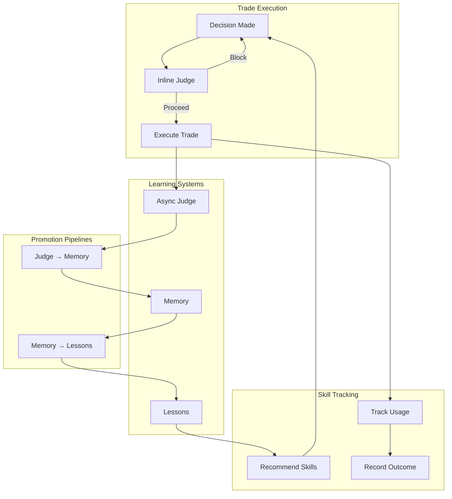
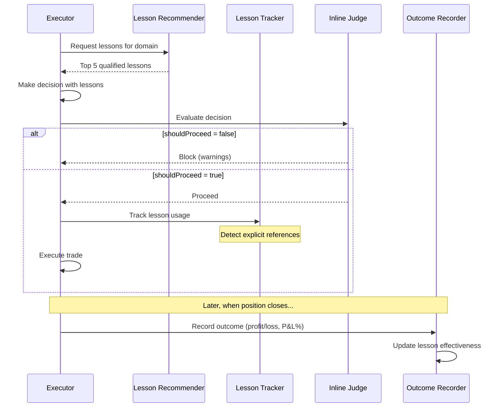
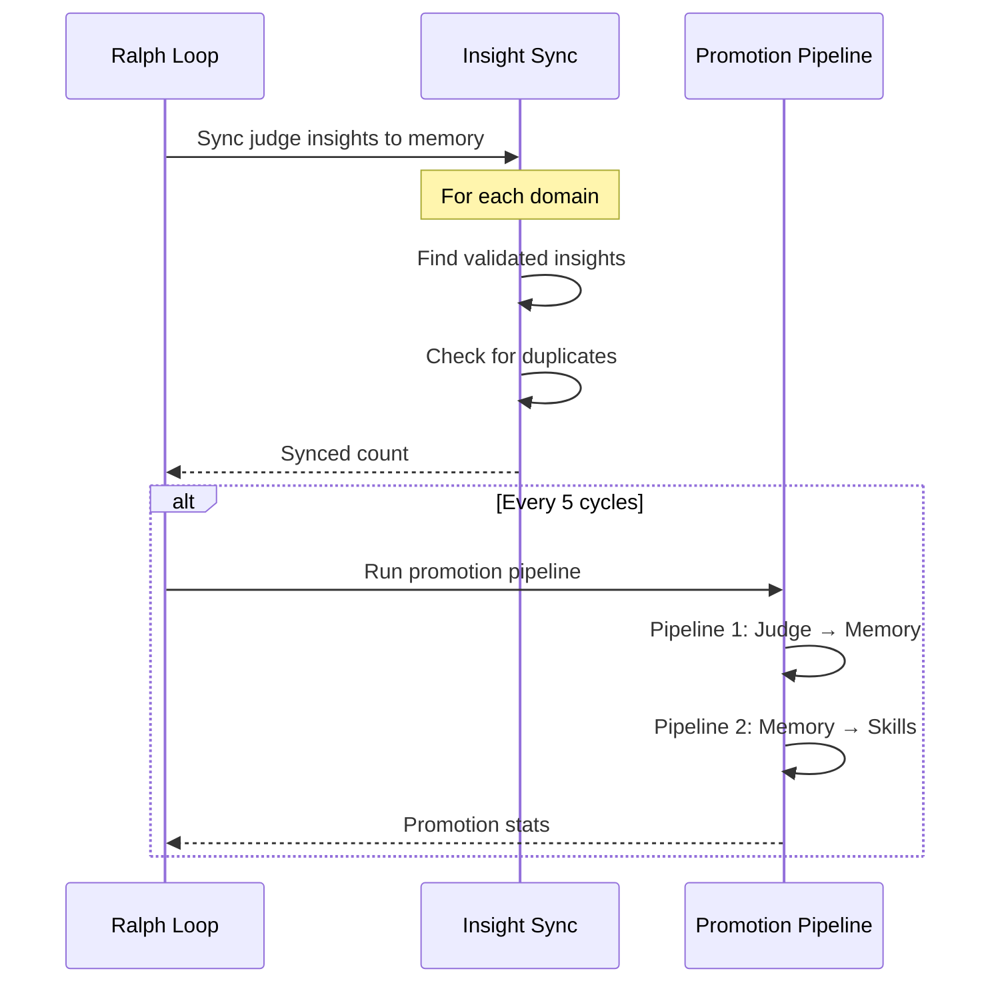

# Learning System Overview

claudefi's learning system creates a continuous feedback loop that improves trading decisions over time. It connects three core systems:

1. **Lessons (Reflections)** - Auto-generated trading rules and patterns
2. **Memory** - Persistent domain knowledge
3. **Judge** - Decision quality tracking

> **Terminology Note**: "Lessons" and "reflections" refer to the auto-generated trading rules (warning-*, pattern-*, strategy-*). These are distinct from Claude Code skills which are invoked via `/skill-name`.

## Architecture



## Key Components

### 1. Lesson Recommendations

Before each decision, the system recommends up to 5 qualified lessons (reflections) based on:

- **Proven effectiveness** - Lessons with ≥3 applications and ≥50% success rate
- **Market relevance** - Context-aware scoring (volatility, trend, recent outcomes)
- **Recency** - Newer lessons get a chance to prove themselves

See [Lesson Recommendations](./lesson-recommendations.md) for details.

### 2. Inline Judge

A same-cycle evaluation that can **block bad decisions before execution**:

- **Fast mode** (Haiku) - ~1-2s for most decisions
- **Thorough mode** (Opus) - ~5-10s for high-stakes decisions (>$500 or >80% confidence)

See [Inline Judge](./inline-judge.md) for details.

### 3. Promotion Pipelines

Data flows between systems through promotion:

```
Judge Insights → Memory Facts → Pattern Lessons
```

- **Pipeline 1**: Validated judge insights (judgeWasRight=true, quality≥0.7) become memory facts
- **Pipeline 2**: Recurring memory patterns (3+ similar facts) become lessons (pattern-* reflections)

See [Promotion Pipelines](./promotion-pipelines.md) for details.

## Data Flow

### Per-Decision Flow



### Per-Cycle Flow



## System Responsibilities

| System | Purpose | Storage | Lifespan |
|--------|---------|---------|----------|
| **Lessons** | Actionable trading rules (reflections) | `.claude/skills/reflections/*.md` | 60-180 days (TTL) |
| **Memory** | Persistent domain knowledge | `MEMORY.md` | Until superseded |
| **Judge** | Decision quality tracking | Database | Until promoted |

## Key Improvements

### Before (Keyword Matching)

```typescript
// Old: 50% keyword threshold caused false positives
function extractAppliedLessons(reasoning: string, lessons: Lesson[]): string[] {
  return lessons.filter(lesson => {
    const words = lesson.name.split('-');
    const matches = words.filter(w => reasoning.includes(w));
    return matches.length / words.length >= 0.5; // Unreliable!
  });
}
```

### After (Explicit Detection)

```typescript
// New: Detect explicit lesson references
const patterns = [
  /['"]lesson-name['"]/,           // Quoted name
  /applying\s+['"]?lesson-name/,   // "Applying lesson-name"
  /based\s+on\s+['"]?lesson-name/, // "Based on lesson-name"
];
```

## Files

| File | Purpose |
|------|---------|
| `src/skills/types.ts` | Core interfaces (QualifiedSkill, SkillRecommendation) |
| `src/skills/skill-recommender.ts` | Recommend qualified lessons |
| `src/skills/skill-tracker.ts` | Track lesson usage in decisions |
| `src/skills/skill-outcome.ts` | Record outcomes, update effectiveness |
| `src/learning/inline-judge.ts` | Same-cycle decision evaluation |
| `src/learning/insight-extractor.ts` | Sync judge insights to memory |
| `src/learning/promotion.ts` | Cross-system promotion pipelines |

> **Note**: The code uses "skill" terminology in filenames for historical reasons. These files handle lesson/reflection logic, not Claude Code skills.

## Testing

Run the learning system tests:

```bash
npx tsx src/test-learning.ts
```

Tests cover:
- Skill type imports and constants
- Skill recommendation and formatting
- Explicit skill detection
- Database tracking
- Outcome recording
- Inline judge modes
- Insight extraction
- Promotion pipelines
- End-to-end flow

## Related Documentation

- [Lesson Recommendations](./lesson-recommendations.md) - Qualified lesson loading
- [Inline Judge](./inline-judge.md) - Same-cycle evaluation
- [Promotion Pipelines](./promotion-pipelines.md) - Cross-system data flow
- [Skills Overview](../skills/overview.md) - Skills & reflections system
- [Database Schema](../database/schema.md) - Data models
