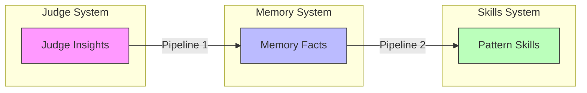
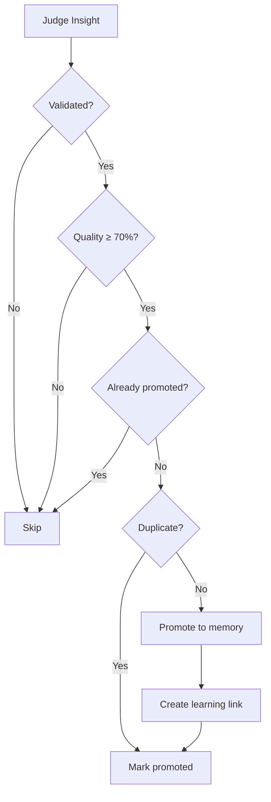
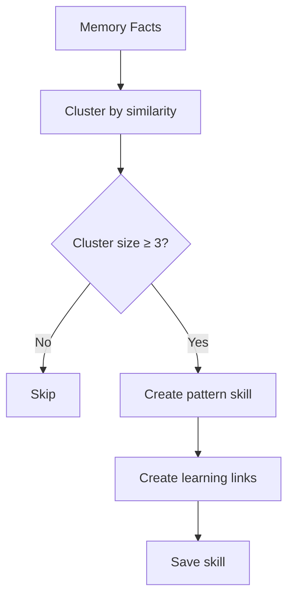

# Promotion Pipelines

Promotion pipelines create data flow between learning systems, consolidating overlapping information and creating a clear progression path from observations to actionable rules.

## Pipeline Overview



## System Responsibilities

| System | Purpose | Storage | Lifespan |
|--------|---------|---------|----------|
| **Judge** | Track decision quality | Database | Until promoted |
| **Memory** | Persistent domain knowledge | `MEMORY.md` | Until superseded |
| **Skills** | Actionable trading rules | `.md` files | 60-180 days (TTL) |

## Pipeline 1: Judge → Memory

Validated judge insights are promoted to persistent memory.

### Promotion Criteria

An insight is promoted when:

1. **Validated**: `judgeWasRight = true` (outcome confirmed the judge's assessment)
2. **High quality**: `qualityScore >= 0.7`
3. **Not promoted yet**: `promotedToMemory = false`
4. **Not duplicate**: Similarity < 60% with existing memory facts



### Deduplication

Uses Jaccard similarity on word sets:

```typescript
function calculateSimilarity(text1: string, text2: string): number {
  const words1 = new Set(text1.toLowerCase().split(/\s+/).filter(w => w.length > 3));
  const words2 = new Set(text2.toLowerCase().split(/\s+/).filter(w => w.length > 3));

  const intersection = new Set([...words1].filter(w => words2.has(w)));
  const union = new Set([...words1, ...words2]);

  return intersection.size / union.size;
}

// Similarity > 60% = duplicate
```

### Importance Mapping

| Quality Score | Importance |
|--------------|------------|
| ≥ 0.85 | high |
| 0.70 - 0.84 | medium |
| < 0.70 | not promoted |

## Pipeline 2: Memory → Skills

Recurring memory patterns are elevated to pattern skills.

### Pattern Detection

When the same concept appears **3+ times** in memory, it's considered a pattern:



### Clustering Algorithm

```typescript
async function detectPatternClusters(domain: Domain): Promise<PatternCluster[]> {
  const facts = await recall(domain);
  const clusters: PatternCluster[] = [];
  const used = new Set<number>();

  for (let i = 0; i < facts.length; i++) {
    if (used.has(i)) continue;

    const cluster: string[] = [facts[i]];
    used.add(i);

    // Find similar facts
    for (let j = i + 1; j < facts.length; j++) {
      if (used.has(j)) continue;
      if (calculateSimilarity(facts[i], facts[j]) > 0.4) {
        cluster.push(facts[j]);
        used.add(j);
      }
    }

    // Only clusters with 3+ facts
    if (cluster.length >= 3) {
      clusters.push({
        domain,
        theme: extractTheme(cluster),
        facts: cluster,
        frequency: cluster.length,
      });
    }
  }

  return clusters;
}
```

### Theme Extraction

Common words across facts become the theme:

```typescript
function extractTheme(facts: string[]): string {
  const wordCounts = new Map<string, number>();

  for (const fact of facts) {
    const words = fact.toLowerCase().split(/\s+/).filter(w => w.length > 4);
    const uniqueWords = new Set(words);

    for (const word of uniqueWords) {
      wordCounts.set(word, (wordCounts.get(word) || 0) + 1);
    }
  }

  // Words appearing in 60%+ of facts
  const commonWords = [...wordCounts.entries()]
    .filter(([, count]) => count >= Math.ceil(facts.length * 0.6))
    .map(([word]) => word);

  return commonWords.slice(0, 3).join('-') || 'recurring-pattern';
}
```

### Generated Skill Format

```markdown
# Pattern: volatility-entry-timing

*Generated from 4 related memory facts*
*Domain: DLMM*

---

## Consolidated Learning

This pattern was detected across multiple trading experiences:

1. Entry timing matters more in high volatility pools
2. Waiting for volatility to settle improves entry
3. High volatility = higher slippage, worse fills
4. Time entries after major price moves settle

## Application

When making dlmm trading decisions, apply this consolidated knowledge:

- **Before entering**: Check if this pattern applies
- **During analysis**: Weight these factors appropriately
- **Risk management**: Adjust position sizing based on pattern confidence

## Origin

This skill was automatically generated by the learning promotion system
after detecting consistent patterns across 4 separate observations.
```

## Learning Links

All promotions are tracked in the `LearningLink` table:

```prisma
model LearningLink {
  id         String   @id @default(uuid())
  sourceType String   // 'judge', 'memory', 'skill'
  sourceId   String   // ID of source record
  targetType String   // 'memory', 'skill'
  targetId   String   // ID of target record
  linkType   String   // 'promoted', 'derived'
  metadata   String   @default("{}")  // JSON metadata
  createdAt  DateTime @default(now())
}
```

### Link Types

| Link Type | Source | Target | Meaning |
|-----------|--------|--------|---------|
| `promoted` | judge | memory | Insight became memory fact |
| `derived` | memory | skill | Facts combined into skill |

## Execution Schedule

Promotion runs every **5 cycles** in the Ralph Loop:

```typescript
// In ralph-loop.ts
if (cycleCount % 5 === 0) {
  const { runPromotionPipeline } = await import('../learning/promotion.js');
  const result = await runPromotionPipeline();

  if (result.insightsToMemory > 0 || result.patternsToSkills > 0) {
    console.log(`   Promoted: ${result.insightsToMemory} to memory, ${result.patternsToSkills} to skills`);
  }
}
```

### Why Every 5 Cycles?

- **Avoid overhead**: Promotion is I/O intensive
- **Allow accumulation**: Need multiple insights for pattern detection
- **Balance freshness**: ~2.5 hours at 30-min cycles

## Insight Extraction

Before promotion, insights are synced from judge to memory at cycle start:

```typescript
// In ralph-loop.ts, step 0.2
const { syncAllDomainInsights } = await import('../learning/insight-extractor.js');
const syncResults = await syncAllDomainInsights();
```

This ensures validated insights are available for the promotion pipeline.

## API

### Run Full Pipeline

```typescript
import { runPromotionPipeline } from './learning/promotion.js';

const result = await runPromotionPipeline();
// result.insightsToMemory - Count promoted to memory
// result.patternsToSkills - Count promoted to skills
// result.linksCreated - Count of learning links
```

### Query Promotion Stats

```typescript
import { getPromotionStats } from './learning/promotion.js';

const stats = await getPromotionStats();
// stats.totalLinks - All learning links
// stats.judgeToMemory - Pipeline 1 links
// stats.memoryToSkill - Pipeline 2 links
```

### Query Promotion Links

```typescript
import { getPromotionLinks } from './learning/promotion.js';

const links = await getPromotionLinks('judge', insightId);
// Returns target records this source was promoted to
```

## Database Schema Updates

### DecisionEvaluation (Updated)

```prisma
model DecisionEvaluation {
  // ... existing fields ...
  promotedToMemory  Boolean   @default(false)
  promotedToSkill   Boolean   @default(false)
  promotedAt        DateTime?
}
```

### LearningLink (New)

```prisma
model LearningLink {
  id         String   @id @default(uuid())
  sourceType String
  sourceId   String
  targetType String
  targetId   String
  linkType   String
  metadata   String   @default("{}")
  createdAt  DateTime @default(now())

  @@index([sourceType, sourceId])
}
```

## Data Flow Example

```
Day 1: Trade executed, judge evaluates
       → DecisionEvaluation: qualityScore=0.85, judgeWasRight=true

Day 2: Insight sync runs
       → Insight promoted to Memory (DLMM domain)
       → LearningLink: judge → memory (promoted)
       → DecisionEvaluation: promotedToMemory=true

Day 3-5: Similar insights accumulate in memory

Day 6: Promotion pipeline runs
       → Pattern detected (4 similar facts)
       → Pattern skill created: pattern-dlmm-volatility-entry
       → LearningLink: memory → skill (derived) × 4

Day 7+: Skill loaded in DLMM decisions
        → Tracked via SkillRecommendation
        → Effectiveness measured
```

## Related Documentation

- [Learning Overview](./overview.md) - Full system architecture
- [Skill Recommendations](./skill-recommendations.md) - How skills are loaded
- [Inline Judge](./inline-judge.md) - Same-cycle evaluation
- [Skills Overview](../skills/overview.md) - Skills system
