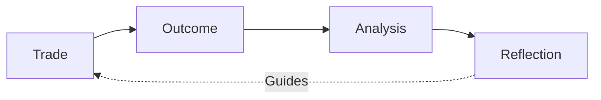
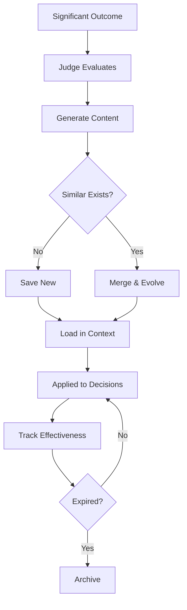

# Skills System Overview

claudefi leverages Claude Code's skills system along with its own self-learning reflections:

1. **Claude Code Skills** - Reusable prompts and workflows (installed globally)
2. **claudefi Skills** - Trading-specific skills for the agent
3. **Reflections** - Self-generated lessons from trading outcomes

## Claude Code Skills

Skills are reusable prompts that extend Claude Code's capabilities. They're installed in `~/.claude/skills/` and invoked with `/skill-name`.

### Trading-Relevant Skills

| Skill | Command | Purpose |
|-------|---------|---------|
| **firecrawl** | `/firecrawl` | Web scraping for protocol docs, market data |

### Skill Examples

**Web Scraping:**
```bash
/firecrawl scrape https://docs.meteora.ag extract API documentation
/firecrawl crawl https://docs.hyperliquid.xyz save to ./docs/hyperliquid/
```

### Skills Location

```
~/.claude/skills/
├── firecrawl/        # Web scraping
└── skill-creator/    # Create new skills
```

### Installing New Skills

Skills can be installed from the marketplace or created manually:

```bash
# Install from marketplace (future)
claude skills install @author/skill-name

# Create manually
mkdir ~/.claude/skills/my-skill
# Add skill markdown files
```

## claudefi Trading Skills

Trading-specific skills live in the claudefi project:

```
.claude/skills/
├── user/                    # User-created trading skills
│   ├── analyze-pool.md
│   └── custom-alerts.md
└── reflections/             # Auto-generated from outcomes
    ├── warning-*.md
    ├── pattern-*.md
    └── strategy-*.md
```

### Built-in Trading Skills

| Skill | Command | Purpose |
|-------|---------|---------|
| Portfolio | `/portfolio` | View all positions across domains |
| Analyze | `/analyze` | Deep-dive on a specific opportunity |
| Research | `/research` | Web search for market context |
| Risk Check | `/risk` | Evaluate portfolio risk exposure |

## Reflections (Self-Learning)

Reflections are auto-generated skills that capture lessons from trading outcomes.



### Reflection Types

| Type | Trigger | TTL | Purpose |
|------|---------|-----|---------|
| **Warning** | Loss > 10% | 60 days | Prevent similar mistakes |
| **Pattern** | Win > 20% | 90 days | Replicate successes |
| **Strategy** | Every 10 trades | 180 days | Comprehensive playbook |
| **Evolved** | Merge event | 180 days | Combined wisdom |

### How Reflections Work

When a position closes with significant P&L:
1. The **Judge** evaluates the decision quality
2. The **Skill Creator** generates a reflection if warranted
3. The **Skill Merger** combines similar reflections
4. Reflections are loaded for future decisions

### Reflection Lifecycle



### Example Warning Reflection

```markdown
# Warning: DLMM Low TVL Pattern

*Generated from loss on 2025-01-07*
*P&L: -$120.50 (-12.5%)*

---

## Pattern to Recognize

- Pool TVL < $50k
- High APR but declining volume
- Thin order book depth

## What Went Wrong

The pool appeared attractive due to high APR but lacked sufficient
trading activity to generate fees.

## Better Approach

1. Verify 24h volume > 2x position size
2. Check volume trend (increasing, not decreasing)
3. Prefer pools with consistent fee generation

## Checklist

- [ ] TVL > $100k
- [ ] 24h volume > 10% of TVL
- [ ] Volume trend: stable or increasing
```

### Example Pattern Reflection

```markdown
# Pattern: Perps RSI Oversold Success

*Generated from win on 2025-01-05*
*P&L: +$185.00 (+24.2%)*

---

## Pattern Conditions

- RSI(14) crosses above 30 from below
- Funding rate is negative
- Price at or near support level

## Entry Criteria

1. Wait for RSI to cross ABOVE 30
2. Confirm funding is negative
3. Use 3-5x leverage max

## Risk Management

- Stop loss: 3% below entry
- Take profit: Scale out at +10%, +15%, +20%
```

## Loading Skills & Reflections

Both types are loaded into Claude's context:

```typescript
async function buildContext(domain: Domain): Promise<string> {
  // Load user skills
  const userSkills = await loadUserSkills();

  // Load domain reflections
  const reflections = await getReflectionsForDomain(domain);

  // Load cross-domain reflections
  const generalReflections = await getGeneralReflections();

  // Filter by effectiveness
  const effective = reflections.filter(r => r.effectiveness >= 0.3);

  return formatContext(userSkills, effective, generalReflections);
}
```

## Related Documentation

- [Skill Types](./types.md) - Detailed type descriptions
- [Skill Generation](./generation.md) - How reflections are created
- [Skill Effectiveness](./effectiveness.md) - Tracking and expiration
- [Custom Skills](./custom-skills.md) - Creating your own skills
